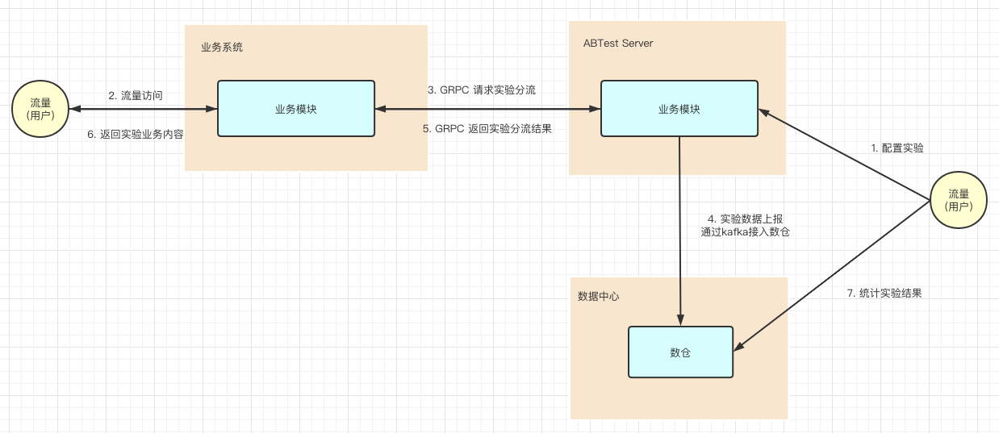
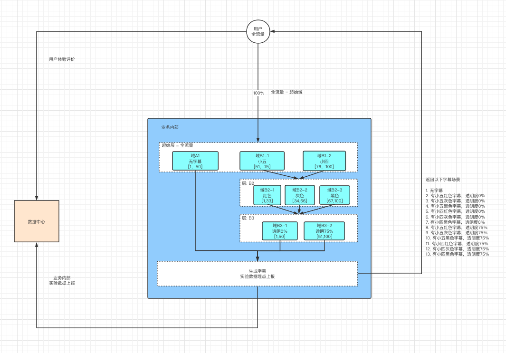
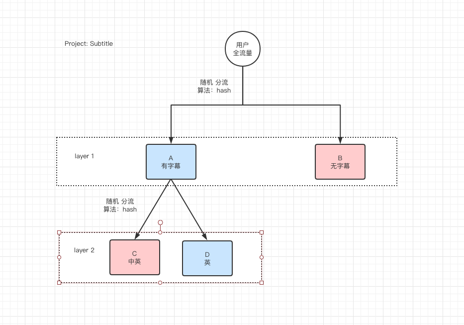

# abtest
A simple A/B Test system, which supports GRPC.

#  AB Test 简介 
A/B测试作为数据驱动增长的核心工具，可以有效地提升流量的转化效率和产研的迭代效率，其重要性不言而喻。

AB 测试是为 Web 或 App 界面或流程制作两个（A/B）或多个（A/B/n）版本，在同一时间维度，分别让组成成分相同（相似）的访客群组（目标人群）随机的访问这些版本，收集各群组的用户体验数据和业务数据，最后分析、评估出最好版本，正式采用。

单个功能的 AB Test 是很容易做的，但与此带来的数据统计拆分，每次都会带来重复的工作量。因此比较节约的方式是，一次性设计好 AB test 功能架构，支持未来的持续 AB test，降低单次测试带来的边际成本。

常见的两种 AB Test 设计方式：
- 两套代码：AB 两个版本的代码分别部署在不同的机器，通过统一的 route r分发流量。好处是对业务侵入性小，灰度发布和正式上线都非常方便。但要求就是开发流程是分支开发模式且代码部署需要和分流路由可用统一配置和联动。且部署成本高，扩展性差。
- 一套代码：业务逻辑中写好各个实验分支，通过在业务服务器里面嵌入 AB 测试框架的client，判断流量是该走哪个分支。这种思路的好处是对外部系统依赖小，全部逻辑都在业务服务。缺点是对业务的侵入性大，代码维护还有整洁度下降。

基于我们的现状，采用“一套代码”方案。

# AB Test 实验流程与架构
1. PM 通过 AB test server 创建生成实验配置文件。
2. 开发人员根据实验配置，通过 grpc 访问 AB test  实现业务分支控制，并上线。（需要人为约定规范，开发需要能理解实验配置，因此建议实验设计是开发和PM一起制定）
3. 每个用户流量进入业务后，grpc 请求 带上 project、hashkey(通常是userID)、layerID 作为参数请求 AB test server，server 根据参数进行hash和取模运算，进行随机分流，返回实验的匹配结果，使用户进入不同的实验。
4. 数据采点，开发人员沟通协作后，在实验的的流程中会通过 grpc 请求一次 AB test server进行实验过程记录。这条记录会记录用户在一次实验中匹配实验的全路径，而同一个流量匹配的实验全路径通过 hash 计算是唯一的，因此只需记录一次即可，如果记录多次会造成数据冗余，请开发人员协作沟通好。
5. PM 通过数据中心，对 ABTest Server 采点记录中的 userID 等信息与业务数据进行关联查询，计算和统计出实验的结果，选择出最优策略
6. 开发人员删除 AB test 代码，迭代上线

如下图所示，是 AB 实验流程：



#  AB Test 架构 中相关概念说明
了能够满足复杂的实验场景，AB Test 架构中设计了 Projec 、Layer 、 Zone 这三个概念，通过这三个概念的组合和嵌套，可以设计出能同时进行多因素的复杂实验场景。

1. Project: 一个完整的 AB Test实验项目。 如下图中，就是一个完整的project实验配置，定义为 Subtitle.

2. Zone: 域，AB 实验的一个实验场景。属于某一层。如下图，起始层分为三个域：A1(无字幕)、B1-1(有小五字幕)、B1-2(有小四字幕)，每个域都是一个实验场景

3. Layer: 层，AB实验的一个时间维度。层内包含了不同版本的实验场景，且进入层时刻的流量会根据权重随机均匀的分配到每个实验场景。如下图，起始层分为三个域：A1(无字幕)、B1-1(有小五字幕)、B1-2(有小四字幕)，进入起始层的流量会随机的分配到不同的域中。

4. 单一因素：通常一个层，只会设计单一因素的实验场景。多个因素的实验可以通过不同层的组合，设计出复杂的实验场景。如下图， 共有三个层：起始层、B2层、B3层，可以测试“字体大小”、“字体颜色”、“字体透明度”三个因素的组合实验。

5. 父域：每个层的流量需要来自于“上一层的域”，这些域被称为“父域”。如下图，B2层的流量来自与“域B1-1”和“域B1-2”两个“父域”。进入B2层/B3层的流量都会再次随机分流到本层的所有域。 

6. 起始域：为全流量。如下图，起始域就是全部用户。

7. 起始层：流量来自于起始域，为全流量。如下图，起始层分为“无字幕”、“有小五字幕”、“有小四字幕”的实验。

8. 举例说明。如下图，是 Project: Subtitle 的实验设计。其中：
- 定义一个Project为 Subtitle。实验配置如图。
- 起始域为用户全流量。起始域的流量进入业务内部后，首先进入实验的起始层。
- 起始层分为三个域：A1/B1-1/B1-2。进入起始层的流量会根据权重随机分配给这三个域。
- 进入A1域后没有下一层，实验结束。返回“无字幕”场景，并上报实验数据。
- 进入B1-1/B1-2域的流量都被指向了下一层B2层。
- B2层分为B2-1/B2-2/B2-3三个域，进入B2层的流量再次根据权重随机分配给这三个域。
- 进入B2-1/B2-2/B2-3域的流量都指向了下一层B3层。
- B3层分为B3-1/B3-2三个域, 进入B3层的流量再次根据权重随机分配给这连个域。
- B3层之后实验结束，返回不同“字体大小”、“字体颜色”、“字体透明度”组合的字幕实验场景，并上报数据。



# AB Test 架构中 hash 算法
1. AB Test server 的 hash 算法根据  grpc 传入的 haskkey 作 hash取模运算，然后根据实验场景的权重进行匹配，以实现随机分流
2. 为保证同一个用户进入的实验始终是唯一，使得用户不会在 AB 实验中反复横跳。因此hashkey 通常使用 userID/deviceID 等唯一性的ID 保证 hash 取值的唯一性。
3. 某些与时间相关的场景，比如为了实现用户每天进行的 AB 实验都是随机的，可以 对 userID + date(日期) 进行hash,使得用户每天进入的 AB 实验都是随机的。
4. 多层实验涉及到多个业务方时，需要各业务方统一约定hashkey，保证同一流量的 hashkey 的唯一性，否则影响实验结果的有效性。

# AB Test 架构中对流量的来源进行校验，确保实验流量的准确性
1. 在本 AB test 框架中，会对进入每一层的流量进行“父域校验”，即校验该流量是否是来自于“父域”。
2. 如果流量不是来自于“父域”，则返回“空值”，因此业务开发必须要对实验增加默认分支，进行兜底。
3. “父域校验”的作用是，可以排除因为代码bug等原因导致错误的流量进入实验，影响实验结果的准确性。
4. 起始层的“父域”是全流量，不需要校验。

# AB Test 架构中实验数据采点
1. 开发人员只需要在实验的全链路中，仅需通过  grpc 进行一次数据采点即可。一次记录会记录用户在一次实验中匹配实验的全路径。

2. 因为同一个流量匹配的实验全路径通过 hash 计算是唯一的，因此只需记录一次即可，如果记录多次反而会造成数据冗余，请开发人员协作沟通好。

3. 实验数据通过 kafka 写入数仓，PM 统计实验结果时，需要与数仓同学对接，将业务数据关联实验数据进行统计，通常是根据 UserID 来关联。

# proto 的方法说明
1. rpc PushABTestData(PushABTestDataRequest) returns (PushABTestDataResponse) {} 
- 作用：匹配实验
- 原理：根据传入的 hashkey + layerID 作hash取模运算，根据指定的project的实验配置，进行匹配，返回匹配的域。
- 参数 projectID:  指定实验
- 参数 hashkey:  根据 hashkey + layerID 进行 hash取模运算，实现随机分流
- 参数 layerID:  当前所在实验层的ID
- 返回值 *Zone:  即根据运算后随机匹配的实验场景 
       使用举例：
```
conn, err := grpc.Dial(GRPCAddress, grpc.WithInsecure())
if err != nil {
    log.Fatalf("grpc.Dial error: %+v", err)
}
defer conn.Close()
 
abtClient := pb.NewABTestClient(conn)
ctx := context.Background()
 
resp, err := abtClient.GetABTestZone(ctx, &pb.GetABTestZoneRequest{
    ProjectID: "Subtitle",
    LayerID:   "Language",
    Hashkey:   user,
})
if err != nil {
    log.Fatalf("abtClient.GetABTestZone error: %+v", err)
}
 
switch resp.GetZone().GetLabel() {
case "CN_EN":
    fmt.Printf("The user goes into Lab %s\n", resp.GetZone().GetLabel())
case "EN":
    fmt.Printf("The user goes into Lab %s\n", resp.GetZone().GetLabel())
default:
    fmt.Printf("The user goes into defualt and the label is [%s\n", resp.GetZone().GetLabel()+"]")
}
```

2. rpc PushABTestData(PushABTestDataRequest) returns (PushABTestDataResponse) {}
- 作用：上报实验数据
- 原理：根据传入的 hashkey + layerID 作hash取模运算，根据指定的project的实验配置，进行匹配，返回匹配的域。
- 参数 projectID:  指定实验
- 参数 hashkey:  进行 hash取模运算，实现随机分流
- 参数 LabData:  用户自定义数据
- 返回值 ：无  
       使用举例：
```
conn, err := grpc.Dial(GRPCAddress, grpc.WithInsecure())
if err != nil {
    log.Fatalf("grpc.Dial error: %+v", err)
}
defer conn.Close()
 
abtClient := pb.NewABTestClient(conn)
ctx := context.Background()
 
resp, err := abtClient.PushABTestData(ctx, &pb.PushABTestDataRequest{
    ProjectID: "Subtitle",
    Hashkey:   user,
})
if err != nil {
    log.Fatalf("abtClient.PushABTestData error: %+v", err)
}
```

# 举例说明
1. 如下图所示，进行字幕 AB test。
2. 定义一个名为 Subtitle 的project
3. 配置实验：定义两个层，第一层有/无字幕，第二层是中英/英字幕，第二层的前提是有字幕，即第二层的“父域”是“A”
4. 假设现在有“前端显示服务F”和“后端字幕服务P”。F的场景有，有字幕显示字幕开关按钮，无字幕不显示；然后是英文字幕时显示"英文"logo，中英字幕时显示"中英"logo。P的场景有返回英文字幕，和返回中英字幕。
5. 在F里面实现 AB test 代码：  
```
conn, err := grpc.Dial(GRPCAddress, grpc.WithInsecure())
if err != nil {
    log.Fatalf("grpc.Dial error: %+v", err)
}
defer conn.Close()
 
abtClient := pb.NewABTestClient(conn)
ctx := context.Background()
 
// 上报实验数据
_, err := abtClient.PushABTestData(ctx, &pb.PushABTestDataRequest{
    ProjectID: "Subtitle",
    Hashkey:   user,
})
if err != nil {
    log.Fatalf("abtClient.PushABTestData error: %+v", err)
}
 
resp, err := abtClient.GetABTestZone(ctx, &pb.GetABTestZoneRequest{
    ProjectID: "Subtitle",
    LayerID:   "Switch",
    Hashkey:   user,
})
if err != nil {
    log.Fatalf("abtClient.GetABTestZone error: %+v", err)
}
     
targetZone := resp.GetZone()
switch targetZone.Value {
case "A":  "有字幕，显示字幕开关按钮，并进入下一层，判断中英/英字幕"
case "B" :  “无字幕，实验结束”
default:
 
...省略...
 
resp, err := abtClient.GetABTestZone(ctx, &pb.GetABTestZoneRequest{
    ProjectID: "Subtitle",
    LayerID:   "Language",
    Hashkey:   user,
})
if err != nil {
    log.Fatalf("abtClient.GetABTestZone error: %+v", err)
}
     
targetZone := resp.GetZone()
switch targetZone.Value {
case "C":  “中英字幕，显示中英logo，并调用字幕服务”
case "D" :  “英文字幕，显示英文logo，并调用字幕服务”
default: 
}
```
6. 在P里面实现 AB test 代码：  
```
resp, err := abtClient.GetABTestZone(ctx, &pb.GetABTestZoneRequest{
    ProjectID: "Subtitle",
    LayerID:   "Language",
    Hashkey:   user,
})
if err != nil {
    log.Fatalf("abtClient.GetABTestZone error: %+v", err)
}
     
targetZone := resp.GetZone()
switch targetZone.Value {
case "C":  “返回中英字幕”
case "D" :  “返回英文字幕”
default:
}
```
7. 每个服务自己将 hashkey、project、layerID作为参数请求 grpc , 返回匹配的实验结果。其中hashkey 需要约定一致。另外数据采点整个链路只需要采点一次即可。
8. 运行时，流量用户进入F , F 的 layer 1 层是, F请求 AB test server, AB test server 根据请求的参数（hashkey、project、layerID）进行hash取模运算后，返回实验匹配的结果，流量走匹配后的实验分支。layer 2 相同
9. 运行时，流量用户进入P， P只有实验的layer 2层, F请求 AB test server, AB test server 根据请求的参数（hashkey、project、layerID）进行hash取模运算后，返回实验匹配的结果，流量走匹配后的实验分支。并进行数据采点，记录实验数据。
10. PM 去数据中心，将业务数据关联 AB test 实验数据，计算和统计实验结果，得出最优策略。


